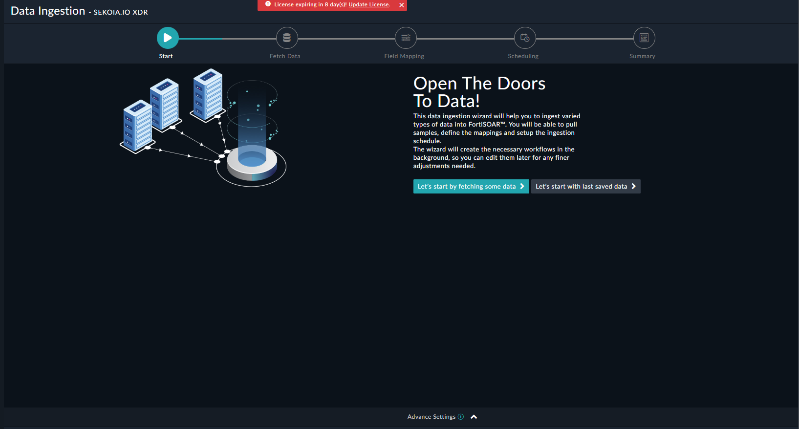
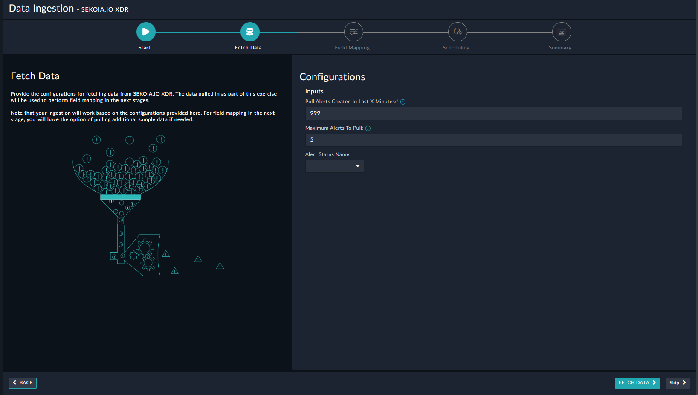
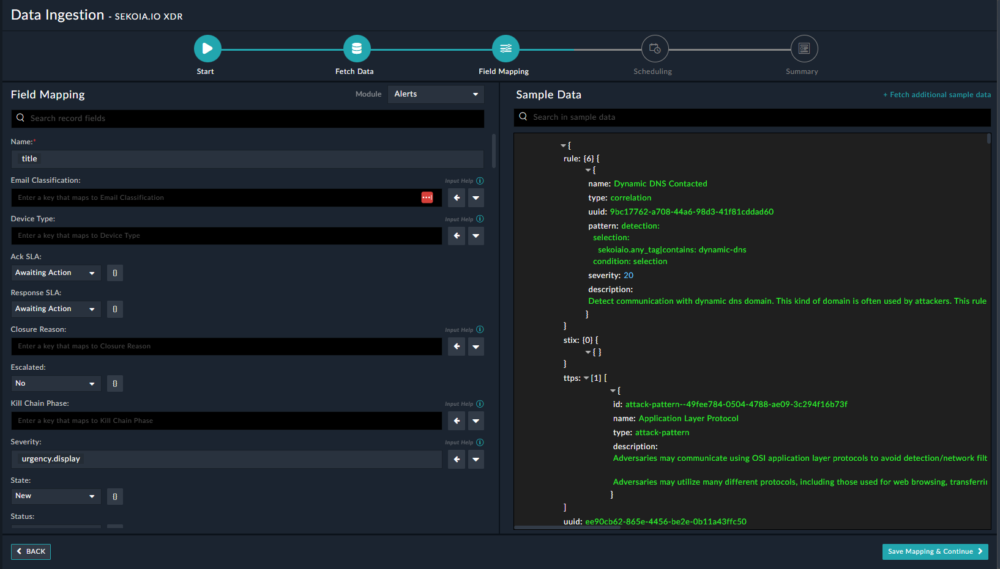
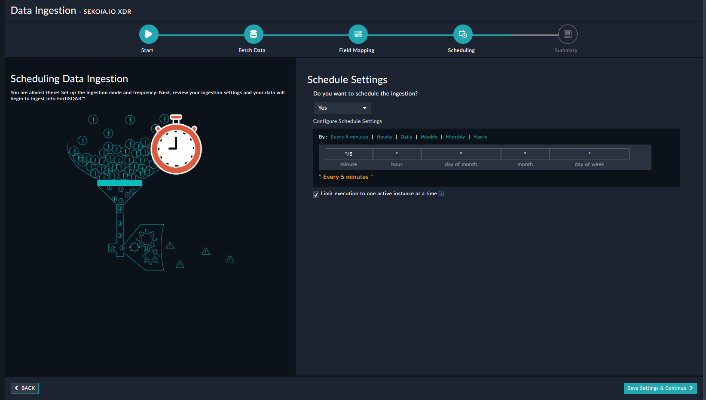

## About the connector
SEKOIA.IO eXtended Detection and Response SaaS platform leverages Cyber Threat Intelligence to combine anticipation with automated incident response. SEKOIA.IO XDR offers open, transparent and flexible security oversight to break down silos and neutralise threats before impact, using intelligence. This connector facilitates automated operations related to alerts, assets and events.

This document provides information about the SEKOIA.IO XDR Connector, which facilitates automated interactions, with a SEKOIA.IO XDR server using FortiSOAR&trade; playbooks. Add the SEKOIA.IO XDR Connector as a step in FortiSOAR&trade; playbooks and perform automated operations with SEKOIA.IO XDR.

### Version information

Connector Version: 1.1.0

Authored By: SEKOIA.IO

Certified: No

## Release Notes for version 1.1.0
Following enhancements have been made to the SEKOIA.IO XDR Connector in version 1.1.0:
<ul>
<li>Added 'Updated Start Date', 'Updated End Date', 'Records Offset' and 'Records Per Page' in 'List Alerts' operation.</li>
<li>
Added the ability to configure data ingestion (using the Data Ingestion Wizard). The Data Ingestion Wizard also

supports multiple configurations specified on the Configurations tab of the SEKOIA.IO XDR connector, ensuring

respective global variables based on the selected configuration are used while ingesting data.
</li>
</ul>

## Installing the connector

Use the <strong>Content Hub</strong> to install the connector. For the detailed procedure to install a connector, click <a href="https://docs.fortinet.com/document/fortisoar/0.0.0/installing-a-connector/1/installing-a-connector" target="_top">here</a>.

You can also use the <code>yum</code> command as a root user to install the connector:

<pre>yum install cyops-connector-sekoia-io-xdr</pre>

## Prerequisites to configuring the connector
- You must have the credentials of SEKOIA.IO XDR server to which you will connect and perform automated operations.
- The FortiSOAR&trade; server should have outbound connectivity to port 443 on the SEKOIA.IO XDR server.

## Minimum Permissions Required
- Not applicable

## Configuring the connector
For the procedure to configure a connector, click [here](https://docs.fortinet.com/document/fortisoar/0.0.0/configuring-a-connector/1/configuring-a-connector)

### Configuration parameters

In FortiSOAR&trade;, on the Connectors page, click the <strong>SEKOIA.IO XDR</strong> connector row (if you are in the <strong>Grid</strong> view on the Connectors page) and in the <strong>Configurations</strong> tab enter the required configuration details:

<table border=1><thead><tr><th>Parameter</th><th>Description</th></tr></thead><tbody><tr><td>API Key</td><td>Specify the API key used to access the SEKOIA.IO XDR server to which you will connect and perform the automated operations.
</td>
</tr><tr><td>Verify Certificate</td><td>Specifies whether the SSL certificate for the server is to be verified or not.
</td>
</tr><tr><td>Proxy</td><td>Specifies whether the proxy for the server is to be verified or not.
</td>
</tr></tbody></table>

## Actions supported by the connector
The following automated operations can be included in playbooks and you can also use the annotations to access operations from FortiSOAR&trade; release 4.10.0 and onwards:
<table border=1><thead><tr><th>Function</th><th>Description</th><th>Annotation and Category</th></tr></thead><tbody><tr><td>Get Events</td><td>Search events according the query from SEKOIA.IO XDR based on the query, earliest time, and latest time you have specified.</td><td>get_events  Investigation</td></tr>
<tr><td>List Alerts</td><td>Retrieves all alerts from SEKOIA.IO XDR based on the input parameters that you have specified.</td><td>list_alerts  Investigation</td></tr>
<tr><td>Get Alert</td><td>Retrieves an specific alert from SEKOIA.IO XDR based on the alert uuid and other input parameters that you have specified. </td><td>get_alert  Investigation</td></tr>
<tr><td>Update Alert Status</td><td>Updates a specific alert in SEKOIA.IO XDR based on the alert identifier and other input parameters that you have specified.</td><td>update_alert_status  Investigation</td></tr>
<tr><td>Add Comment to Alert</td><td>Add a new comment to the specific alert in SEKOIA.IO XDR based on the alert identifier, comment, and other input parameter you have specified.</td><td>add_comment_to_alert  Investigation</td></tr>
<tr><td>Get Asset</td><td>Retrieves an specific asset from SEKOIA.IO XDR based on the asset uuid you have specified.</td><td>get_asset  Investigation</td></tr>
<tr><td>Update Asset</td><td>Updates a specific asset in SEKOIA.IO XDR based on the asset uuid, asset type uuid, asset type name, and other input parameters that you have specified.</td><td>update_asset  Investigation</td></tr>
<tr><td>Delete Asset</td><td>Delete an specific asset from SEKOIA.IO XDR based on the asset uuid you have specified.</td><td>delete_asset  Investigation</td></tr>
<tr><td>Activate a Countermeasure</td><td>Activate a countermeasure in SEKOIA.IO XDR based on the countermeasure uuid, comment and other input parameters that you have specified.</td><td>activate_countermeasure  Investigation</td></tr>
<tr><td>Deny a Countermeasure</td><td>Deny a countermeasure in SEKOIA.IO XDR based on the countermeasure uuid, comment and other input parameters that you have specified.</td><td>deny_countermeasure  Investigation</td></tr>
</tbody></table>

### operation: Get Events

#### Input parameters
<table border=1><thead><tr><th>Parameter</th><th>Description</th></tr></thead><tbody><tr><td>Query</td><td>The query to search events
</td></tr><tr><td>Earliest Time</td><td>The earliest time of the time range of the search
</td></tr><tr><td>Latest Time</td><td>The latest time of the time range of the search
</td></tr></tbody></table>

#### Output

 The output contains a non-dictionary value.

### operation: List Alerts

#### Input parameters

<table border=1><thead><tr><th>Parameter</th><th>Description</th></tr></thead><tbody><tr><td>Filter by Status Identifier</td><td>Filter alerts according the identifiers of their status.
</td></tr><tr><td>Filter by Status Name</td><td>Filter alerts according the name of their status.
</td></tr><tr><td>Short ID</td><td>Filter alerts according their short_id.
</td></tr><tr><td>Rule UUID</td><td>Filter alerts according the identifiers of rules that raised them
</td></tr><tr><td>Rule Name</td><td>Filter alerts according the names of rules that raised them
</td></tr><tr><td>Creation Start Date</td><td>Filter alerts according to their first creation date. Time in ISO format (rfc3339)
</td></tr><tr><td>Creation End Date</td><td>Filter alerts according to their last creation date. Time in ISO format (rfc3339)
</td></tr><tr><td>Updated Start Date</td><td>Filter alerts according to their first updation date. Time in ISO format (rfc3339)
</td></tr><tr><td>Updated End Date</td><td>Filter alerts according to their last updation date. Time in ISO format (rfc3339)
</td></tr><tr><td>Records Offset</td><td>A number of records to skip, default is 0
</td></tr><tr><td>Records Per Page</td><td>Number of records to return per call
</td></tr></tbody></table>

#### Output

 The output contains a non-dictionary value.

### operation: Get Alert

#### Input parameters

<table border=1><thead><tr><th>Parameter</th><th>Description</th></tr></thead><tbody><tr><td>Alert UUID</td><td>The unique identifier of the alert (uuid or short_id)
</td></tr><tr><td>Include Comments</td><td>Option to include comments of the alert
</td></tr><tr><td>Include STIX</td><td>Option to include the stix of the alert
</td></tr><tr><td>Include History</td><td>Option to include the history of the alert
</td></tr><tr><td>Include Countermeasures</td><td>Option to include the countermeasures of the alert
</td></tr></tbody></table>

#### Output

 The output contains a non-dictionary value.

### operation: Update Alert Status

#### Input parameters

<table border=1><thead><tr><th>Parameter</th><th>Description</th></tr></thead><tbody><tr><td>Alert Identifier</td><td>The unique identifier of the alert (uuid or short_id)
</td></tr><tr><td>Action UUID</td><td>The unique identifier of the action
</td></tr><tr><td>Comment</td><td>The comment to associate to the action
</td></tr></tbody></table>

#### Output

 The output contains a non-dictionary value.

### operation: Add Comment to Alert

#### Input parameters

<table border=1><thead><tr><th>Parameter</th><th>Description</th></tr></thead><tbody><tr><td>Alert Identifier</td><td>The unique identifier of the alert (uuid or short_id)
</td></tr><tr><td>Comment</td><td>The content of the comment
</td></tr><tr><td>Author</td><td>The author of the comment
</td></tr></tbody></table>

#### Output

 The output contains a non-dictionary value.

### operation: Get Asset

#### Input parameters

<table border=1><thead><tr><th>Parameter</th><th>Description</th></tr></thead><tbody><tr><td>Asset UUID</td><td>The unique identifier of the asset
</td></tr></tbody></table>

#### Output

 The output contains a non-dictionary value.

### operation: Update Asset

#### Input parameters

<table border=1><thead><tr><th>Parameter</th><th>Description</th></tr></thead><tbody><tr><td>Asset UUID</td><td>The unique identifier of the asset
</td></tr><tr><td>Asset Name</td><td>The name of the asset
</td></tr><tr><td>Asset Type UUID</td><td>The uuid of the asset type
</td></tr><tr><td>Asset Type Name</td><td>The name of the asset type
</td></tr><tr><td>Asset Criticity</td><td>The criticity of the asset
</td></tr><tr><td>Asset Description</td><td>The description of the asset
</td></tr><tr><td>Asset Attributes</td><td>The attributes of the asset
</td></tr><tr><td>Asset Keys</td><td>The keys of the assets
</td></tr><tr><td>Asset Owners</td><td>the owners of the assets
</td></tr></tbody></table>

#### Output

 The output contains a non-dictionary value.

### operation: Delete Asset

#### Input parameters

<table border=1><thead><tr><th>Parameter</th><th>Description</th></tr></thead><tbody><tr><td>Asset UUID</td><td>The unique identifier of the asset
</td></tr></tbody></table>

#### Output

 The output contains a non-dictionary value.

### operation: Activate a Countermeasure

#### Input parameters

<table border=1><thead><tr><th>Parameter</th><th>Description</th></tr></thead><tbody><tr><td>Countermeasure UUID</td><td>The unique identifier of the countermeasure
</td></tr><tr><td>Comment</td><td>The content of the comment to associate to the countermeasure
</td></tr><tr><td>Author</td><td>The author of the comment to associate to the countermeasure
</td></tr></tbody></table>

#### Output

 The output contains a non-dictionary value.

### operation: Deny a Countermeasure

#### Input parameters

<table border=1><thead><tr><th>Parameter</th><th>Description</th></tr></thead><tbody><tr><td>Countermeasure UUID</td><td>The unique identifier of the countermeasure
</td></tr><tr><td>Comment</td><td>The content of the comment to associate to the countermeasure
</td></tr><tr><td>Author</td><td>The author of the comment to associate to the countermeasure
</td></tr></tbody></table>

#### Output

 The output contains a non-dictionary value.

## Included playbooks

The `Sample - sekoia-io-xdr - 1.1.0` playbook collection comes bundled with the SEKOIA.IO XDR connector. These playbooks contain steps using which you can perform all supported actions. You can see bundled playbooks in the **Automation** > **Playbooks** section in FortiSOAR&trade; after importing the SEKOIA.IO XDR connector.

- > Sekoia.io > Fetch
- Activate a Countermeasure
- Add Comment to Alert
- Delete Asset
- Deny a Countermeasure
- Get Alert
- Get Asset
- Get Events
- List Alerts
- Sekoia.io> Ingest
- Update Alert Status
- Update Asset

**Note**: If you are planning to use any of the sample playbooks in your environment, ensure that you clone those playbooks and move them to a different collection since the sample playbook collection gets deleted during connector upgrade and delete.

## Data Ingestion Support

Use the Data Ingestion Wizard to easily ingest data into FortiSOAR&trade; by pulling events/alerts/incidents, based on the requirement.

